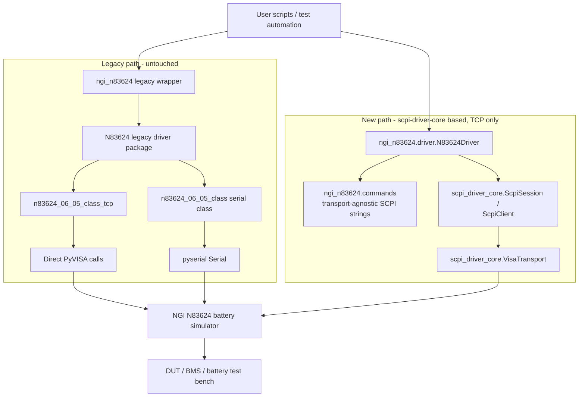

# Software architecture

## Current package architecture

Two independent paths exist side by side. The legacy path (`N83624/`, wrapped by
`ngi_n83624`) is untouched and keeps working exactly as it always has. The new path
(`ngi_n83624/driver.py`) is a parallel, in-progress reimplementation of the TCP path on
top of the shared [`scpi-driver-core`](https://github.com/ami3go/scpi-driver-core)
package. Neither depends on the other; nothing here refactors one into the other.

## Why two paths instead of one refactor

The repository's compatibility requirement rules out rewriting `N83624/` in place: existing
scripts calling `n83624_06_05_class_tcp` directly must keep working unmodified. Building
the new driver as a separate, additive module (`ngi_n83624/driver.py`) satisfies that
without freezing the old design in place — it can be developed, tested, and eventually
promoted independently of the legacy code's release cadence.

## What the new path replaces, and how

| Legacy (`N83624/n83624_06_05_class.py`) | New (`ngi_n83624/driver.py`) |
|---|---|
| Direct `pyvisa.ResourceManager().open_resource(...)` calls | `scpi_driver_core.VisaTransport` + `ScpiSession`/`ScpiClient` |
| Hand-rolled `for i in range(100): try/except` query retry loop | `scpi_driver_core.RetryPolicy` (`QUERY_RETRY_POLICY`), reproduced 1:1 (100 attempts, 5s delay) |
| No recovery when a timeout leaves the VISA session unusable | `ScpiSession.recover_if_faulted`, wired in as `before_retry` — fixes a real bug found during migration: every transport backend faults and releases its resource on any I/O error, so retrying without reopening first always failed |
| `self.inst.query_delay = 4.5` before reading current | `current_settle_s` (same 4.5s default), or opt-in `*OPC?`-based sync via `wait_for_completion()` (`sync_before_current=True`) |
| Manual two-step CSV parsing + rounding | `scpi_driver_core.parse_csv_floats`, with rounding restored to match |
| `print()`-based validation, silent value clamping | Unchanged for now — `commands.py`'s `range_check` keeps the same clamp-and-warn behavior as the legacy driver, so migrating the transport layer doesn't also silently change validation semantics |

The command-string builders (`storage`, `_ch_range`, `ch_str_param`, etc.) were extracted
into `ngi_n83624/commands.py` unchanged and are shared conceptually with the legacy
driver's copy (the legacy file still has its own, to avoid touching it) — they never
touch a transport, so they're identical either way and are the one piece of this
migration that's fully unit-tested independent of any transport or hardware.

## Scope boundaries

- **Serial is not migrated.** `N83624Serial`/`n83624_06_05_class_serial` remain
  legacy-only; the new driver only covers the TCP (VISA `TCPIP::SOCKET`) path so far.
- **`short_circuit_test`/`cmc_set_voltage` are not ported.** These are bench-specific
  test sequences and safety judgment calls layered on top of the primitives, not driver
  primitives themselves — they belong in an adapter built on top of the driver, per the
  driver/adapter split most SCPI-driver standards in this ecosystem use (see
  [Lab-equipment-pyDrivers](https://github.com/ami3go/Lab-equipment-pyDrivers)).
- **Not validated against real hardware.** Every timing constant
  (`QUERY_RETRY_POLICY`, `CURRENT_QUERY_SETTLE_S`, `OPC_RETRY_POLICY`) and the `*OPC?`
  sync path were either reproduced from the legacy driver's numbers or are best-effort
  guesses; `scripts/validate_hardware.py` exists to check them against the real
  instrument.

## Migration path

Once the new driver has been validated against real hardware (voltage/current accuracy,
`*OPC?` support, retry timing) it can absorb Serial support the same way TCP was done —
`N83624Driver` only talks to a `ScpiSession`, so a serial-backed session works
unmodified once `SerialTransport` is wired in; no driver-class changes are needed for
that. After that, promoting the new driver to the package's default public import
(instead of the legacy wrapper) would be a deliberate, separately-decided breaking
change, not an automatic next step.
