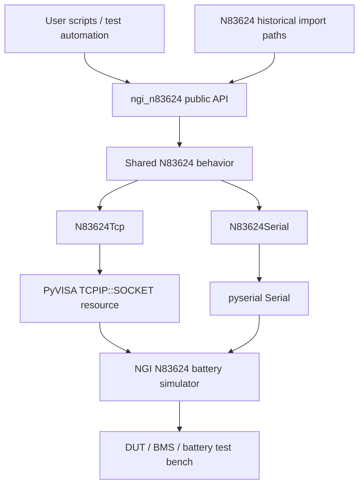

# Software architecture

## Current package architecture



## Design decisions

### One behavior layer, two transports

TCP/VISA and serial previously contained large duplicated copies of the command and high-level driver logic. The copies had already diverged, including different validation behavior and a serial `out_on_all()` bug. Version 0.2.0 keeps transport-specific I/O in `N83624Tcp` and `N83624Serial`, while all device-facing behavior lives once in the shared base implementation.

### Explicit validation, no silent clamping

Values outside documented/configured ranges raise `N83624ValidationError` before an instrument command is sent. A library controlling a source must not silently convert a caller's invalid requested value into a different hardware state.

### Bounded communication

Every transport has a finite timeout and query retry count. Query exhaustion raises a typed exception. The old 100-attempt retry loop could occupy a caller for several minutes and then return `None`; that behavior is removed.

### Deterministic ownership

`N83624Tcp` owns and closes both the PyVISA resource and its `ResourceManager`. `N83624Serial` owns and closes the serial port. Close is idempotent. `shutdown()` attempts output-off before resource release.

### Compatibility at module boundaries

Files under `N83624/` remain available, but they are now thin shims over `ngi_n83624`. Common historical names such as `n83624_06_05_class_tcp`, `n83624_06_05_class`, and `storage` continue to resolve without preserving the broken duplicated implementation.

## Package responsibilities

```text
ngi_n83624/driver.py
    transport ownership
    finite retry/timeout behavior
    locking
    high-level N83624 methods
    parsing and cleanup

ngi_n83624/commands.py
    SCPI command construction
    channel/value validation
    compatibility storage() hierarchy

ngi_n83624/exceptions.py
    typed validation, connection, communication, timeout, protocol,
    and short-circuit exceptions

N83624/*.py
    historical import compatibility only
```

## Test architecture

Default CI is hardware-free:

```text
unit/property tests
       |
       +--> command builders and validation
       |
       +--> fake PyVISA resource manager/instrument
       |
       +--> fake pyserial endpoint
       |
       +--> timeout/retry/cleanup regressions
```

Real hardware acceptance tests should be separately marked `hardware` and must include safe-state cleanup appropriate to the bench.

## Future migration

`scpi-driver-core` is a natural next extraction target for generic transport/session/retry infrastructure. That migration should be done as a behavior-preserving step with HIL evidence rather than coupled to additional N83624 feature changes.
