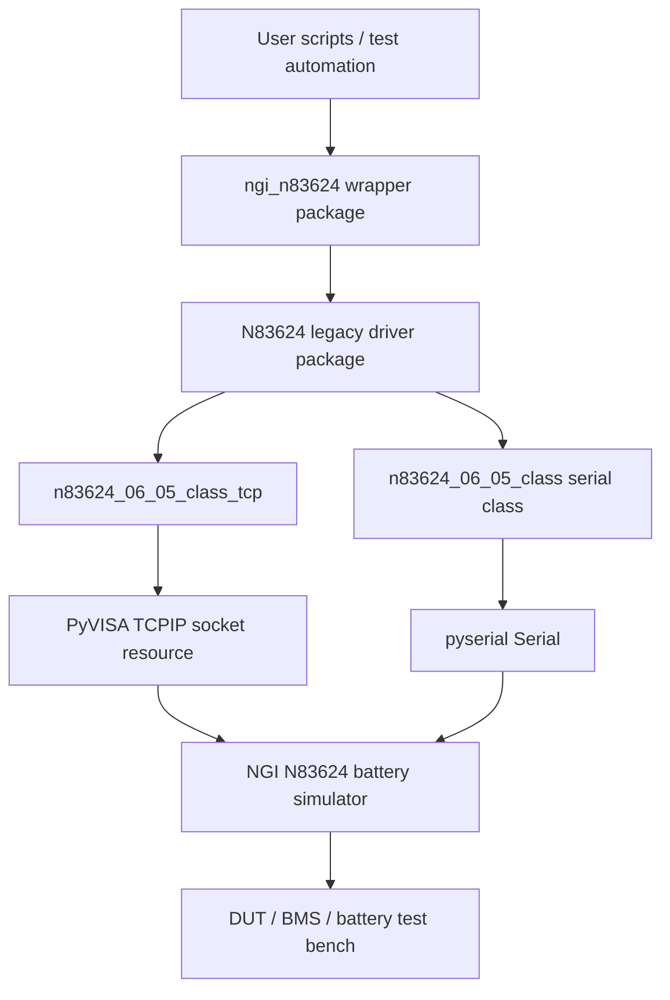

# Software architecture

## Current package architecture

## Design decision

The repository already contained working scripts in `N83624/`, `Functions/`, and `Example/`. The packaging update keeps those paths intact to avoid breaking existing code. A small lower-case package, `ngi_n83624`, provides a stable import surface for new code.

## Migration path

Future production refactoring can add a typed high-level driver under `ngi_n83624/` while keeping the existing legacy classes as compatibility aliases.
