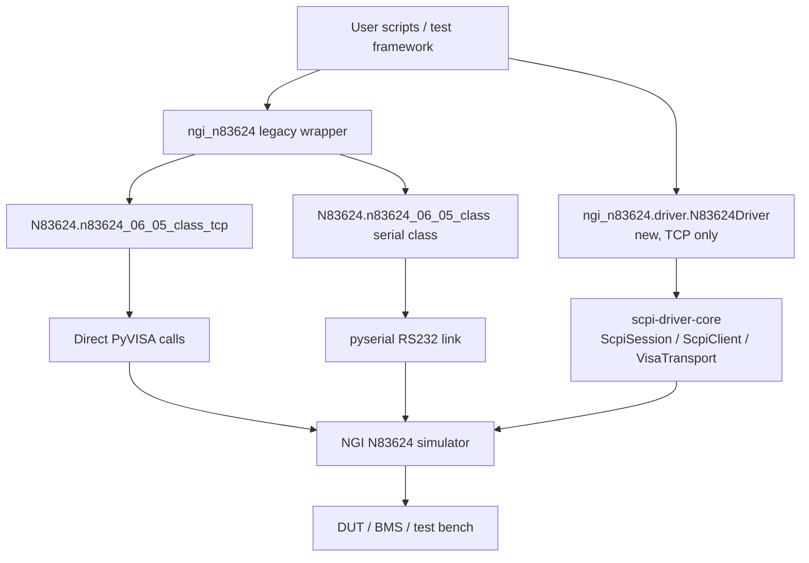

# NGI N83624 Battery Simulator Python Driver

Python support library and examples for controlling the **NGI N83624 Series battery/cell simulator**.

This repository contains the original scripts and vendor manuals, plus packaging support so the code can be installed as a Python module with `pip`.

## Install

From a local checkout:

```bash
git clone https://github.com/ami3go/NGI-N83624-Battery-simulator.git
cd NGI-N83624-Battery-simulator
python -m pip install -e .
```

Development install:

```bash
python -m pip install -e ".[dev]"
pytest
```

## Import examples

Legacy TCP/VISA class:

```python
from ngi_n83624 import N83624Tcp

ngi = N83624Tcp()
ngi.init("TCPIP0::192.168.0.123::7000::SOCKET", max_ch=24)
print(ngi.get_idn())
ngi.close()
```

Direct legacy package import also works:

```python
from N83624 import n83624_06_05_class_tcp
```

Legacy serial class:

```python
from ngi_n83624 import N83624Serial

ngi = N83624Serial()
if ngi.init_ser("COM5", max_ch=24):
    print(ngi.get_idn())
    ngi.close()
```

New TCP driver, built on [`scpi-driver-core`](https://github.com/ami3go/scpi-driver-core) (migration in progress — see below):

```python
from ngi_n83624.driver import N83624Driver

ngi = N83624Driver.connect_tcp("TCPIP0::192.168.0.111::7000::SOCKET", max_ch=24)
ngi.set_voltage(3.7)
ngi.out_on()
print(ngi.get_voltage())
ngi.close()
```

## Migration to scpi-driver-core

`ngi_n83624/driver.py` (`N83624Driver`) is a parallel, in-progress reimplementation of the
TCP path on top of the shared [`scpi-driver-core`](https://github.com/ami3go/scpi-driver-core)
package, replacing direct PyVISA calls with `ScpiSession`/`ScpiClient`, and the fragile
100-attempt query retry loop with `scpi_driver_core`'s `RetryPolicy` plus automatic
transport-fault recovery. It does not touch or replace `N83624/n83624_06_05_class.py` or the
legacy `ngi_n83624` wrapper — both keep working exactly as before.

- `ngi_n83624/commands.py` — the SCPI command-string builders, ported unchanged (transport-agnostic,
  fully unit-tested without hardware).
- `ngi_n83624/driver.py` — the new driver class, covering the TCP core primitives
  (voltage/current/output/measurement). Serial is not migrated yet. `short_circuit_test` and
  `cmc_set_voltage` (bench-specific test sequences) are intentionally not ported — they belong
  in an adapter layered on top of the driver, not the driver itself.

None of this has been validated against real hardware yet — every timing constant
(`QUERY_RETRY_POLICY`, `CURRENT_QUERY_SETTLE_S`, `OPC_RETRY_POLICY`) and the `*OPC?`-based
sync path (`wait_for_completion()`) are simulated-transport-only so far. Run
[`scripts/validate_hardware.py`](scripts/validate_hardware.py) against the real instrument to
check them:

```bash
python scripts/validate_hardware.py TCPIP0::192.168.0.111::7000::SOCKET          # read-only
python scripts/validate_hardware.py TCPIP0::192.168.0.111::7000::SOCKET --output # also drives output
```

Read-only by default; `--output` is required to run anything that changes output state
(`set_voltage`/`set_current`/`out_on`/`out_off`), and is scoped to one configurable channel with
a 3-second pause (and a loud warning) before touching it.

## Repository layout

```text
N83624/                      Original N83624 driver classes
Functions/                   Original helper functions
ngi_n83624/                  Installable wrapper package / public import surface
ngi_n83624/commands.py       SCPI command-string builders (transport-agnostic)
ngi_n83624/driver.py         New TCP driver built on scpi-driver-core (migration in progress)
scripts/validate_hardware.py Real-hardware validation for the new driver's unvalidated assumptions
Example/                     Existing usage examples
Docs/Programming Guide/      Vendor programming manuals
Docs/User Manual/            Vendor user manuals
Docs/Driver/                 Packaging and architecture notes
tests/                       Package/import smoke tests
pyproject.toml               Build metadata and dependencies
```

## Software architecture map



Two independent paths, not one refactored into the other — see
[Migration to scpi-driver-core](#migration-to-scpi-driver-core) above and
[Docs/Driver/software_architecture.md](Docs/Driver/software_architecture.md) for the full
picture, including what the new path replaces and why. The legacy driver code in
`N83624/` is unmodified either way, to avoid breaking existing scripts.

## Documentation

- [Packaging guide](Docs/Driver/packaging.md)
- [Software architecture](Docs/Driver/software_architecture.md)
- [Software generation/support task](SOFTWARE_GENERATION_TASK.md)
- [Hardware validation script](scripts/validate_hardware.py) for the new driver
- Vendor SCPI manual: `Docs/Programming Guide/N83624 Series Programming Guide-SCPI V20240130.pdf`

## Runtime dependencies

The installable module declares these runtime dependencies:

- `pyserial`
- `pyvisa`
- `colorama`
- `numpy`
- [`scpi-driver-core`](https://github.com/ami3go/scpi-driver-core) (installed from GitHub; used by the new `ngi_n83624.driver` module)

Example scripts may require additional packages depending on the workflow.

## Production note

Before 24/7 production use, validate communication, safety limits, output-off behavior,
fault handling, and long-duration stability on the exact instrument model and firmware
used in the test bench — for either driver path.

The new `ngi_n83624.driver.N83624Driver` path in particular has not been run against
real hardware at all yet; run [`scripts/validate_hardware.py`](scripts/validate_hardware.py)
against the instrument before relying on it for anything.

## License

MIT. See [LICENSE](LICENSE).
