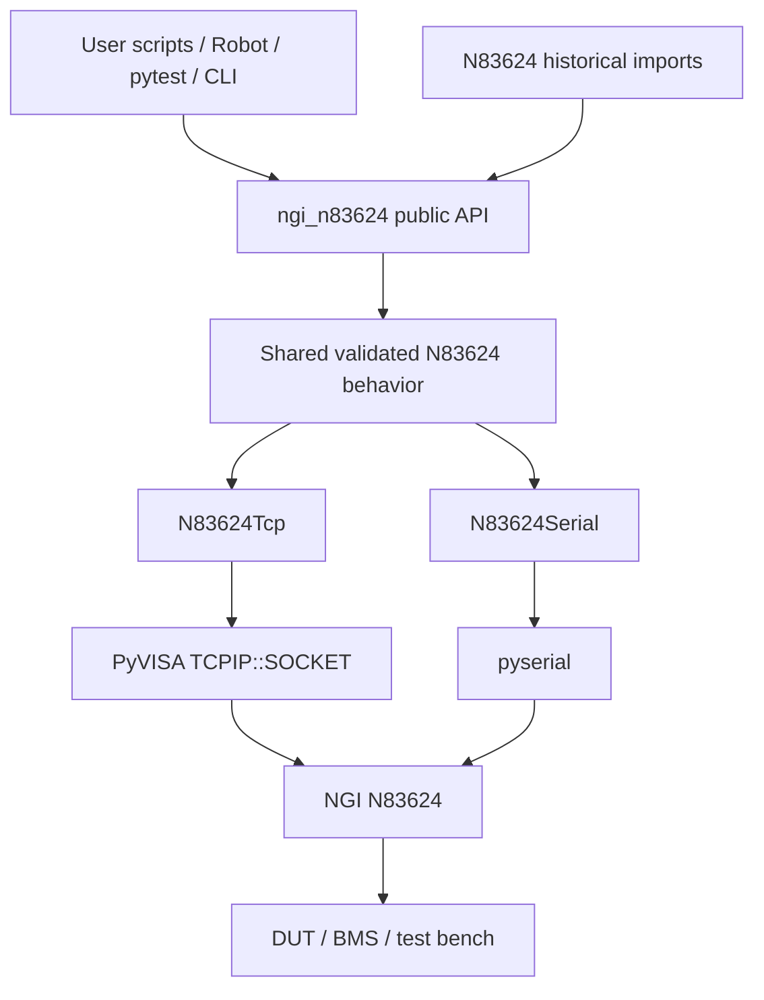

# NGI N83624 Battery Simulator Python Driver

Python driver and support material for the **NGI N83624 Series high-accuracy multi-channel battery/cell simulator**.

Version **0.2.0** replaces the duplicated first-generation TCP and serial implementations with one reviewed high-level driver while keeping the historical import paths as compatibility shims.

## Installation

```bash
python -m pip install .
```

Development installation:

```bash
python -m pip install -e ".[dev]"
pytest -m "not hardware"
```

The runtime driver requires only `pyvisa` and `pyserial`. Example-only packages such as NumPy, pandas, and colorama are available through:

```bash
python -m pip install -e ".[examples]"
```

## TCP / PyVISA usage

```python
from ngi_n83624 import N83624Tcp

ngi = N83624Tcp(
    "TCPIP0::192.168.0.123::7000::SOCKET",
    timeout_s=5.0,
    query_attempts=3,
)

try:
    print(ngi.connect())
    ngi.working_channels = [1, 16]
    ngi.set_current(500)
    ngi.set_voltage(3.7)
    ngi.out_on()
    print(ngi.get_voltage())
finally:
    # shutdown() attempts output-off before closing the transport.
    ngi.shutdown()
```

The historical initialization form remains supported:

```python
ngi = N83624Tcp()
ngi.init("TCPIP0::192.168.0.123::7000::SOCKET", max_ch=24)
```

## Serial usage

```python
from ngi_n83624 import N83624Serial

ngi = N83624Serial("COM5", timeout_s=5.0)
try:
    print(ngi.connect())
    ngi.set_voltage(3.6)
    ngi.out_on_all()
finally:
    ngi.shutdown()
```

Compatibility form:

```python
ngi = N83624Serial()
if ngi.init_ser("COM5", max_ch=24):
    print(ngi.get_idn())
    ngi.close()
```

Unlike the previous serial wrapper, `N83624Serial` now exposes the same high-level channel, output, measurement, range, and fault-simulation methods as the TCP driver.

## Safety and failure behavior

The reviewed implementation deliberately fails visibly instead of silently changing requested hardware state:

- invalid voltage/current/channel values raise `N83624ValidationError`; they are **not clamped**;
- invalid current-range, sampling-rate, and fault-simulation strings raise instead of falling back to a different mode;
- queries have a finite retry count (default 3) and finite transport timeout;
- an exhausted query raises `N83624TimeoutError` or `N83624CommunicationError`; it never silently returns `None`;
- VISA resources and the `ResourceManager` are closed deterministically;
- serial and VISA transactions are serialized with a re-entrant lock;
- `short_circuit_test()` uses `finally` cleanup to attempt output-off on both pass and failure;
- `shutdown()` attempts to turn every configured channel off before releasing the transport.

Software output-off is not a substitute for hardware interlocks, fusing, emergency-stop design, or bench-specific safety validation.

## Working channels

```python
ngi.working_channels = [3, 8]
ngi.set_voltage(4.0)        # CH3..CH8
ngi.set_current(250)        # CH3..CH8
ngi.out_on()
voltages = ngi.get_voltage()
```

An invalid range such as `[8, 3]`, channel 0, or a channel greater than the configured `max_ch` raises immediately before SCPI traffic is sent.

## Compatibility imports

New code should use:

```python
from ngi_n83624 import N83624Tcp, N83624Serial
```

Historical imports remain valid:

```python
from N83624 import n83624_06_05_class_tcp
from N83624.n83624_06_05_class import storage
```

The legacy class names now point to the reviewed implementation, and the historical `storage()` command namespace is retained.

## Test harness

The normal CI suite is hardware-free and runs on Python 3.10, 3.11, 3.12, and 3.13. It includes:

- deterministic unit tests for SCPI command construction and validation;
- fake PyVISA integration tests covering connect/query/write/retry/cleanup behavior;
- fake serial integration tests covering full-driver API and bounded timeout/retry behavior;
- Hypothesis property tests for channel ranges and grouped command generation;
- `pytest-timeout` per-test and suite watchdogs;
- coverage enforcement for `ngi_n83624`;
- Ruff lint/format checks, compile checks, and package build validation.

Physical-instrument tests should use the `hardware` marker and remain separate from default CI.

## Repository layout

```text
ngi_n83624/                  Reviewed public driver, command builders, exceptions
N83624/                      Backward-compatible historical import shims
Functions/                   Existing repository helper functions
Example/                     Existing usage examples
Docs/Programming Guide/      Vendor programming manuals
Docs/User Manual/            Vendor user manuals
Docs/Driver/                 Architecture, packaging, and review documentation
tests/                       Hardware-free regression/property/integration tests
pyproject.toml               Build metadata and dependency declarations
```

## Architecture



## Documentation

- [Production code review](Docs/Driver/code_review_2026-09-19.md)
- [Software architecture](Docs/Driver/software_architecture.md)
- [Packaging guide](Docs/Driver/packaging.md)
- [Software generation/support task](SOFTWARE_GENERATION_TASK.md)
- Vendor SCPI guide: `Docs/Programming Guide/N83624 Series Programming Guide-SCPI V20240130.pdf`

## License

MIT. See [LICENSE](LICENSE).
